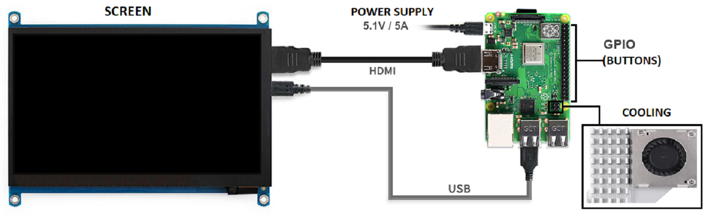
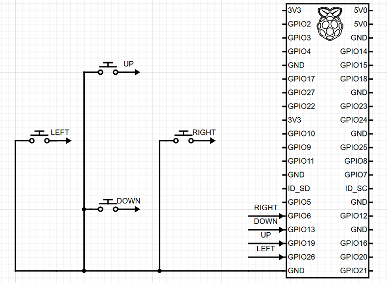
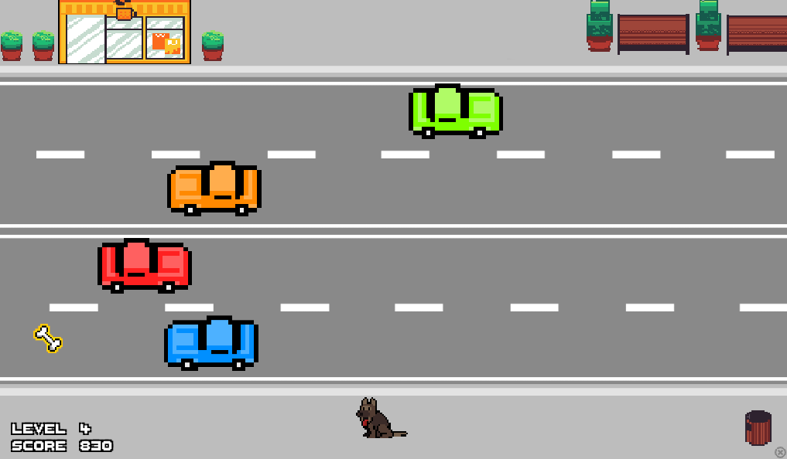
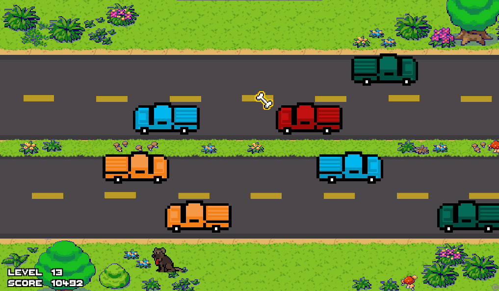
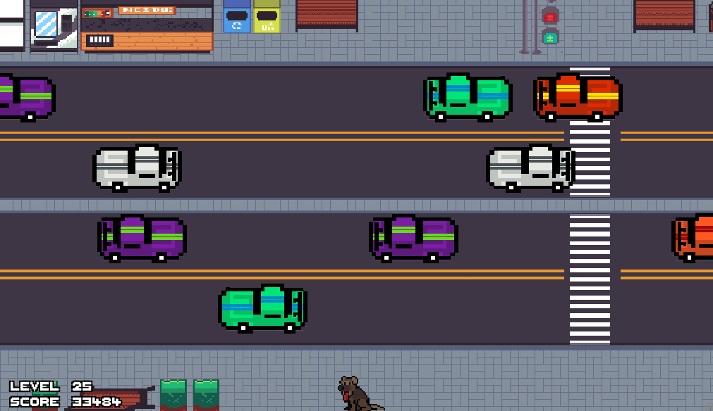
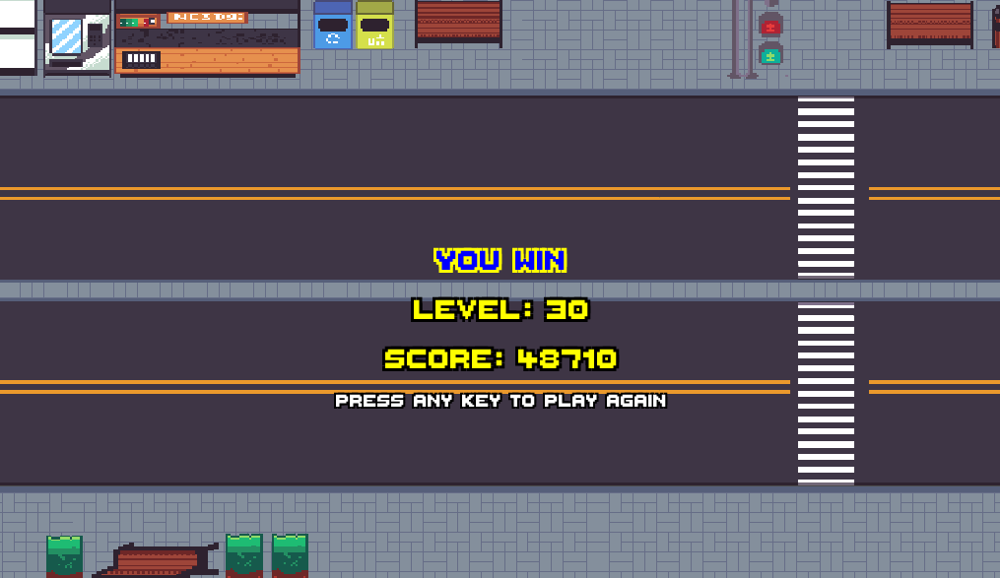

# CrossTheRoad

CrossTheRoad is a 2D game built with Python and Pygame, designed to run on a custom game console powered by a Raspberry Pi. The console uses external buttons, an LCD screen, and cooling components to provide an engaging gaming experience. The player controls a dog character, navigating through traffic and collecting bones while avoiding collisions with cars.

## Features

- **Dynamic Gameplay**: Increasing difficulty as the player progresses through levels.
- **Custom Sprites**: Animated dog character with multiple movement directions.
- **Level Progression**: Backgrounds and car types change as levels increase.
- **Bonus Items**: Collect bones for bonus points.
- **Game Over and Win Screens**: Displays level and score with styled text.

## Console Setup

The game is designed to run on a Raspberry Pi with external devices such as an LCD screen, buttons, and cooling. Below is the diagram showing how to connect these components:



## GPIO Button Connections

The game is designed to be played on a Raspberry Pi using external buttons. Below is the diagram showing how to connect the buttons to the GPIO ports:



## Installation

1. Clone the repository:
   ```sh
   git clone https://github.com/your-username/CrossTheRoad.git
   cd CrossTheRoad
   ```

2. Install the required dependencies:
   ```sh
   pip install pygame gpiozero
   ```

3. Ensure the game assets (images, fonts) are in the correct directory structure as provided in the repository.

## How to Play

1. Run the game:
   ```sh
   python main.py
   ```

2. Use the following controls to move the dog:
   - **Up**: GPIO Button 23
   - **Down**: GPIO Button 17
   - **Left**: GPIO Button 22
   - **Right**: GPIO Button 27

3. Avoid cars and reach the top of the screen to progress to the next level.

4. Collect bones for bonus points.

5. The game ends when the dog collides with a car or when the player wins by completing all levels.

## File Structure

- [`main.py`](main.py): Main game logic and entry point.
- [`spritesheet.py`](spritesheet.py): Handles sprite sheet processing for animations.
- [`colors.py`](colors.py): Predefined color constants for the game.
- [`font`](font): Contains the custom font used in the game.
- [`models`](models): Contains all game assets, including backgrounds, cars, and dog sprites.
- [`exit.png`](exit.png): Exit button image.

## Requirements

- Python 3.11 or later
- Pygame
- GPIO Zero (for button controls)

## Screenshots

Here are some screenshots from the game:

- **Level 1 - 9**  
  

- **Level 10 - 19**  
  

- **Level 20 - 29**  
  

- **You Win Screen**  
  

## Demo Video

Here’s a short preview of the CrossTheRoad game console in action:


## Contributing

Contributions are welcome! Feel free to submit issues or pull requests to improve the game.

